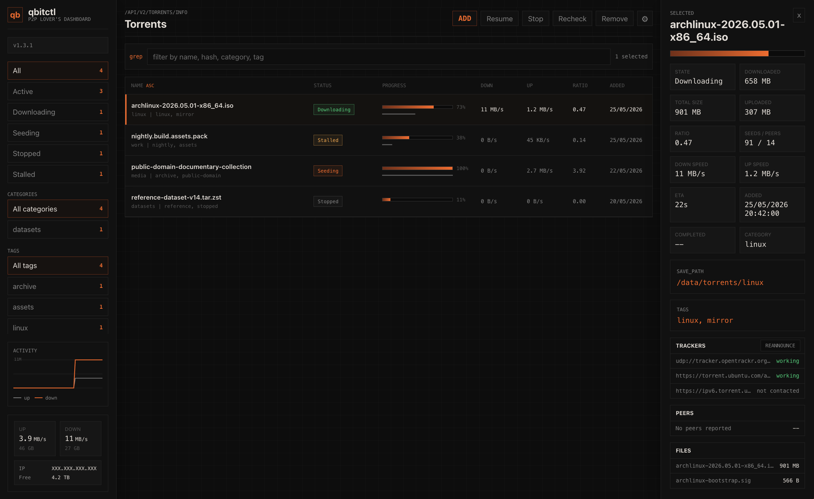

# qbitctl-webui

Dark, terminal-inspired qBittorrent WebUI built with React. The interface keeps the qBittorrent API surface close at hand while using a grey scale palette, orange accent, dense torrent rows, sortable columns, tag filters, quick tag editing, settings, and add-torrent workflows.



## Screenshots

### Add Torrent


### Quick Tag Editing


### Settings


## Features

### Torrent management

- Sortable torrent table (name, status, progress, down/up speed, ratio, added date) with a sticky header and toolbar.
- Status filters for all, active, downloading, seeding, stopped, and stalled torrents, plus category filters, all with live counts.
- Multi-select tag filters with AND matching: a torrent must carry every selected tag to show.
- Search bar matching name, hash, category, tags, status, and save path.
- Multi-select rows with Shift, Cmd, or Ctrl for resume, stop, recheck, and remove actions.
- Remove confirmation modal with an optional `Delete downloaded data` checkbox (off by default).
- Add modal accepting multiple `.torrent` files and magnet/URL paste, with tags applied at add time and an `Add stopped` option for import workflows (add stopped, recheck, then resume).

### Torrent details

- Selected torrent panel with state, sizes, speeds, ratio, seeds/peers, ETA, added/completed dates, category, and save path.
- Quick tag editing with one-click toggles for existing tags.
- Tracker list with per-tracker status; click a tracker to expand its latest response message and peer counts, with force reannounce for the torrent or from any tracker row.
- File and peer lists for the selected torrent.

### Interface

- Dark, terminal-inspired theme with configurable accent color and a compact table density option.
- Activity graph of upload/download speed history with the peak value labeled on the Y axis.
- Transfer totals, external IP, and free disk space in the sidebar.
- UI state (filters, search, sort, and appearance settings) persists across sessions in browser local storage.
- Modals close on backdrop click.
- Settings modal with common qBittorrent preferences, the full advanced preference list, and a revert-to-default-WebUI action.

### Updates and compatibility

- Sidebar version button: checks GitHub once per page load, highlights available updates, and opens a modal with the changelog, the release link, and the connected qBittorrent version. Can be hidden in settings.
- Works with both qBittorrent API generations (`torrents/start`/`torrents/stop` with fallback to `torrents/resume`/`torrents/pause`).
- Preview mode with sample data whenever the qBittorrent API is unreachable, for local development.
- Release pipeline that tests, builds, generates a changelog, and uploads `qbitctl-<version>.zip` plus a stable-URL `qbitctl.zip`.

## Install From A Release

Download the [latest release](https://github.com/mstraa/qbitctl-webui/releases/latest/download/qbitctl.zip) and unzip it somewhere qBittorrent can read:

```bash
curl -fL -o qbitctl.zip \
  https://github.com/mstraa/qbitctl-webui/releases/latest/download/qbitctl.zip
unzip -oq qbitctl.zip
```

Then enable it by following qBittorrent's [Alternate WebUI documentation](https://github.com/qbittorrent/qBittorrent/wiki/Alternate-WebUI-usage), pointing the WebUI path at the extracted `qbitctl/public` folder.

The download URL always serves the newest version. To update, re-run the same two commands and reload the WebUI — the extracted path never changes, so qBittorrent needs no reconfiguration.

To revert, open qbitctl settings and use `Revert to default qBittorrent WebUI`, or disable `Use alternative WebUI` in qBittorrent.

## Build It Yourself

### Requirements

- Node 18 (the version used by CI; anything from Node 17 up needs the legacy OpenSSL flag shown below because of the older Webpack 4 stack)
- Yarn 1.x (classic)

### Setup

```bash
git clone https://github.com/mstraa/qbitctl-webui.git
cd qbitctl-webui
yarn install --frozen-lockfile
```

### Local development

```bash
NODE_OPTIONS=--openssl-legacy-provider yarn start
```

This starts the dev server on `http://localhost:3000` (set `PORT` to change it). Without a reachable qBittorrent API the UI falls back to built-in preview data, so you can develop the interface without a running qBittorrent instance.

Run the tests with:

```bash
yarn test --watchAll=false
```

### Build and package

```bash
NODE_OPTIONS=--openssl-legacy-provider yarn build
yarn package:release
```

`yarn build` outputs the WebUI to `build/public`. `yarn package:release` wraps it and creates:

```text
dist/qbitctl-<version>.zip
dist/qbitctl.zip
```

The version defaults to the one in `package.json`; pass one explicitly with `yarn package:release 1.3.0`. Each zip contains a top-level folder (`qbitctl-<version>/` or `qbitctl/`) with the built WebUI under `public/`. Point qBittorrent's alternative WebUI path at that `public` folder (see [Install From A Release](#install-from-a-release)).

## Release Pipeline

The GitHub Actions workflow in `.github/workflows/release.yml` runs tests, builds the WebUI, packages `build/public`, generates release notes from the commits since the previous version tag, and publishes both `qbitctl-<version>.zip` and the fixed-name `qbitctl.zip` on the release. Each release is marked latest, so `releases/latest/download/qbitctl.zip` always serves the newest version.

Create a release by pushing a version tag:

```bash
git tag v1.0.0
git push origin v1.0.0
```

The workflow can also be run manually from GitHub Actions with an optional version input. Manual runs upload the zip as a workflow artifact. Tagged runs also publish it to the GitHub release.

## qBittorrent API Notes

qbitctl expects to be served by qBittorrent as an alternative WebUI. Live mode uses the same-origin qBittorrent API endpoints under `/api/v2/*`. When run locally with `yarn start`, it falls back to preview data when the qBittorrent API is not available.

## Privacy

The repository does not include personal IP addresses, tokens, qBittorrent credentials, or local configuration files. Runtime values such as external IP and free space are fetched dynamically in the browser and are not stored in the source tree.

---

Based on `ntoporcov/qbittorrent-webui-react-boilerplate`.
