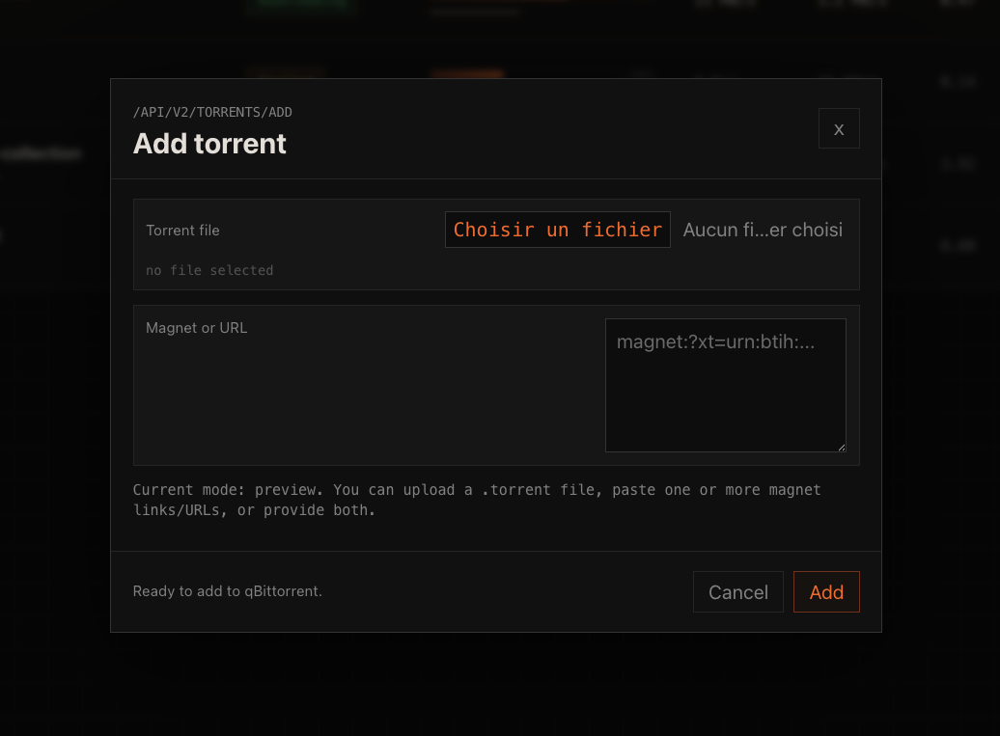
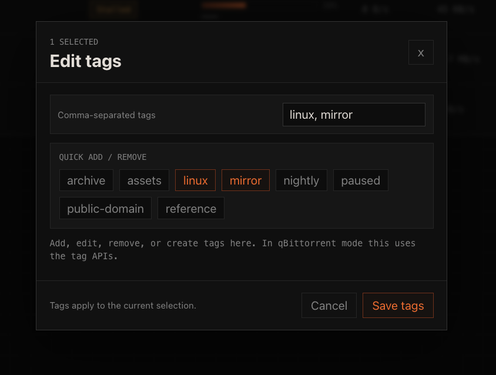
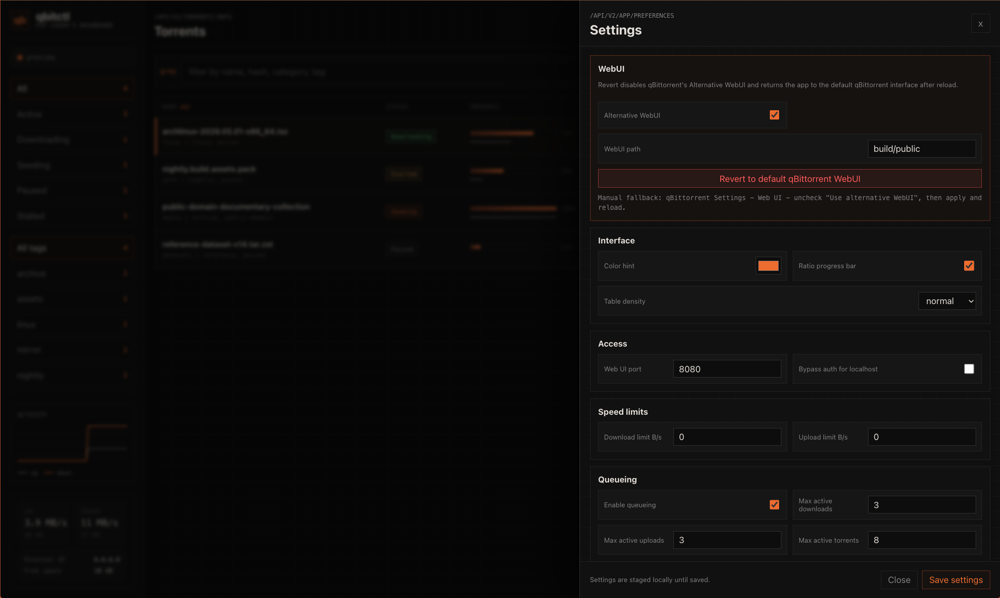

# qbitctl

Dark, terminal-inspired qBittorrent WebUI built with React. The interface keeps the qBittorrent API surface close at hand while using a grey scale palette, orange accent, dense torrent rows, sortable columns, tag filters, quick tag editing, settings, and add-torrent workflows.


## Screenshots

### Add Torrent



### Quick Tag Editing



### Settings



## Features

- Custom dark qBittorrent WebUI with configurable accent color.
- Torrent filters for all, active, downloading, seeding, paused, stalled, and tags.
- Sortable torrent table with status, progress, speed, ratio, and added date.
- Multi-select with Shift, Cmd, or Ctrl for resume, pause, and remove actions.
- Add modal for `.torrent` uploads and magnet/URL paste.
- Selected torrent panel with files, trackers, save path, category, and quick tag editing.
- Settings modal with qBittorrent preferences, advanced settings, compact mode, ratio progress toggle, and default WebUI revert action.
- Release pipeline that builds `build/public`, wraps it as `qbitctl-<version>/public/`, and uploads `qbitctl-<version>.zip`.

## Install From A Release

1. Download `qbitctl-<version>.zip` from the GitHub release.
2. Unzip it somewhere qBittorrent can read, for example:

   ```bash
   unzip qbitctl-1.0.6.zip -d /opt/qbittorrent-webuis
   ```

3. In qBittorrent, open `Tools -> Options -> Web UI`.
4. Enable `Use alternative WebUI`.
5. Set the WebUI path to the extracted `qbitctl-<version>/public` folder.
6. Apply the settings and reload the qBittorrent WebUI.

To revert, open qbitctl settings and use `Revert to default qBittorrent WebUI`, or disable `Use alternative WebUI` in qBittorrent.

## Build It Yourself

This project uses Yarn and an older Create React App/Webpack stack. Node 18 works with the legacy OpenSSL flag.

```bash
yarn install --frozen-lockfile
NODE_OPTIONS=--openssl-legacy-provider yarn build
yarn package:release
```

The packaged file will be created at:

```text
dist/qbitctl-<version>.zip
```

The zip contains a top-level `qbitctl-<version>/` folder with the built WebUI under `public/`. Point qBittorrent's alternative WebUI path at `qbitctl-<version>/public`.

## Release Pipeline

The GitHub Actions workflow in `.github/workflows/release.yml` runs tests, builds the WebUI, packages `build/public`, and uploads the zip.

Create a release by pushing a version tag:

```bash
git tag v1.0.0
git push origin v1.0.0
```

The workflow can also be run manually from GitHub Actions with an optional version input. Manual runs upload the zip as a workflow artifact. Tagged runs also publish it to the GitHub release.

## qBittorrent API Notes

qbitctl expects to be served by qBittorrent as an alternative WebUI. Live mode uses the same-origin qBittorrent API endpoints under `/api/v2/*`. When run locally with `yarn start`, it falls back to preview data when the qBittorrent API is not available.

## Privacy

The repository does not include personal IP addresses, tokens, qBittorrent credentials, or local configuration files. Runtime values such as external IP and free space are fetched dynamically in the browser and are not stored in the source tree.

---

Based on `ntoporcov/qbittorrent-webui-react-boilerplate`.
